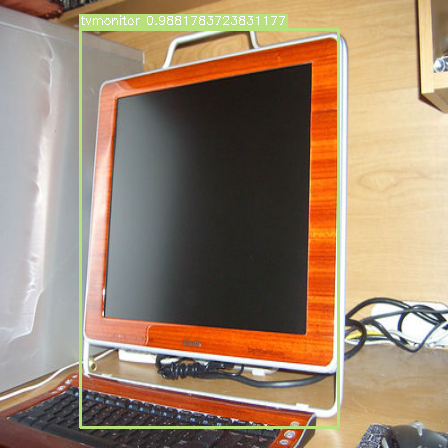
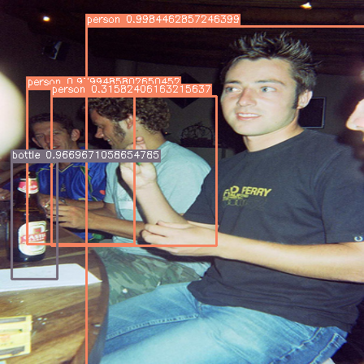
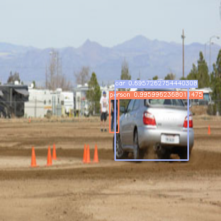
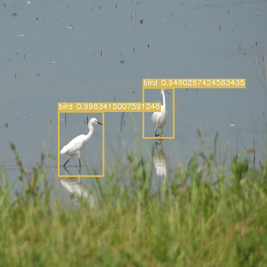

# YOLO v1 PyTorch Implementation

[简体中文 Simplified Chinese](./README.zh.md)

**I wrote this repo for the purpose of learning, aimed to reproduce YOLO v1 using PyTorch.** It is very hard to pretrain the original network on ImageNet, so I replaced the backbone with ResNet18 and ResNet50 with PyTorch pretrained version for convenience. However, the original network backbone is also defined in `yolo.py`, and is available for training. Pretraining method is not yet finished (and maybe would never be finished since I've achieved reasonable results using other backbones), and is marked TODO in the file.

Besides, I removed the Dropout layer and added Batch Normalization after every convolution layer according to [yolo v2](https://arxiv.org/pdf/1612.08242.pdf).

The implementation of loss function is exact as the [original paper](https://arxiv.org/pdf/1506.02640.pdf). Also, I adapted all the hyper parameters from the paper, and the network is trained on VOC2007-trainval+test and VOC2012-train, tested on VOC2012-val using RTX2070s.

Here is the structure of the project.

```
webcam.py                     # webcam demo
utils
├── data.py                   # data pipeline
├── init.py                   # weight initialization
├── metrics.py                # mAP calculation
├── utils.py                  # helper, e.g. Accumulator, Timer
└── visualize.py              # visualization
yolo
├── tests.py                  # test wrapping
└── yolo.py                   # YOLO module, loss, nms implementation
```

## Performance

|         Model          | Backbone | mAP@VOC2012-val | COCOmAP@VOC2012-val |    FPS     |
| :--------------------: | :------: | :-------------: | :-----------------: | :--------: |
| YOLOv1-ResNet18 (Ours) | ResNet18 |     48.10%      |       23.18%        | **235.47** |
| YOLOv1-ResNet50 (Ours) | ResNet50 |   **49.87%**    |     **23.95**%      |   95.94    |

|         Model          | Backbone | mAP@VOC2012-test |    FPS    |
| :--------------------: | :------: | :--------------: | :-------: |
| YOLOv1-ResNet18 (Ours) | ResNet18 |      44.54%      | **97.88** |
| YOLOv1-ResNet50 (Ours) | ResNet50 |    **47.28%**    |   58.40   |
|         YOLOv1         | Darknet? |    **57.9%**     |    45     |

Leaderboard Link:

* Our [YOLOv1-ResNet18](http://host.robots.ox.ac.uk:8080/leaderboard/displaylb_main.php?challengeid=11&compid=3#KEY_YOLOv1-resnet-18-50)
* Our [YOLOv1-ResNet50](http://host.robots.ox.ac.uk:8080/leaderboard/displaylb_main.php?challengeid=11&compid=4#KEY_YOLOv1-resnet-18-50)

More comparison across categories:

|         Model          | mean  | aero plane | bicycle | bird  | boat  | bottle |  bus  |  car  |  cat  | chair |  cow  |
| :--------------------: | :---: | :--------: | :-----: | :---: | :---: | :----: | :---: | :---: | :---: | :---: | :---: |
|          YOLO          | 57.9  |    77.0    |  67.2   | 57.7  | 38.3  |  22.7  | 68.3  | 55.9  | 81.4  | 36.2  | 60.8  |
| YOLOv1-ResNet18 (Ours) | 44.5  |    64.3    |  54.2   | 47.4  | 26.8  |  16.6  | 55.4  | 44.3  | 66.5  | 23.1  | 38.1  |
| YOLOv1-ResNet50 (Ours) | 47.3  |    66.7    |  56.1   | 49.5  | 25.9  |  17.8  | 60.2  | 45.9  | 70.6  | 26.1  | 43.0  |

|         Model          | dining<br>table |  dog  | horse | motor<br>bike | person | potted<br>plant | sheep | sofa  | train | tv<br>monitor |
| :--------------------: | :-------------: | :---: | :---: | :-----------: | :----: | :-------------: | :---: | :---: | :---: | :-----------: |
|          YOLO          |      48.5       | 77.2  | 72.3  |     71.3      |  63.5  |      28.9       | 52.2  | 54.8  | 73.9  |     50.8      |
| YOLOv1-ResNet18 (Ours) |      38.5       | 62.9  | 57.6  |     60.8      |  45.0  |      15.2       | 33.3  | 43.9  | 60.0  |     37.2      |
| YOLOv1-ResNet50 (Ours) |      41.1       | 67.5  | 59.2  |     62.4      |  47.6  |      17.6       | 35.6  | 45.7  | 64.6  |     42.4      |

Honestly the results are not very ideal, but now I am focusing on more modern archs and tricks to improve the results.









## Note

When running the notebook for the first time, you should add `, download=True` param to `load_data_voc` to download dataset. It is suggested to remove the param after everything's set, since it is time-consuming to unarchive the data every time.

## Training

If you want to train the model totally by yourself, use `resnet18-yolo-train.ipynb` and `resnet50-yolo-train.ipynb`.

I trained the network using RTX2070s-8GB, so I also implemented gradient accumulation due to OOM problem. The true `batch_size` is determined by both `batch_size` of `DataLoader` and `accum_batch_num` param from `train` method. In the case of `resnet18-yolo-train.ipynb`, `batch_size = 16 (dataloader/batch_size) * 4 (accum_batch_num)`. You can adjust the param according to specific cases. Besides, DataParallel is also supported by specifying `num_gpu` param of `train()`.

Here are some training loss plot:

ResNet18 (Backbone):

<div align="center">
	
</div>

ResNet50 (Backbone):

<div align="center">
	
</div>

## Testing

Model weight are available in repo release. Place the weights in `./model/` folder, and run `resnet18-yolo-test.ipynb` and `resnet50-yolo-test.ipynb`.

Here is also a demo using using webcam (`webcam.py`).

2022/05/10 Update: According to VOC postscripts, during evaluation, the objects with the tag of "difficult" are excluded, but will not penalize if detected. I missed this statement before, and the good news is that the mAP of both models increased by about 4% now after excluding them.

2022/05/13 Update: `voc2012test.py` was added to generate VOC2012 test results. Evaluation scores are also published in README. If you want to test it by yourself, please place VOC2012 test data in the current folder like below.

```
.
README.md                   # Other files
VOC2012test                 # create dataset folder
└── VOCdevkit
    └── VOC2012
        ├── Annotations
        ├── ImageSets
        └── JPEGImages
```

VOC2012 test dataset download link:

* [pjreddie mirror](https://pjreddie.com/projects/pascal-voc-dataset-mirror/)

## Thanks

* https://github.com/abeardear/pytorch-YOLO-v1
* https://arxiv.org/pdf/1506.02640.pdf
* https://arxiv.org/pdf/1612.08242.pdf
* https://homepages.inf.ed.ac.uk/ckiw/postscript/ijcv_voc09.pdf
* https://homepages.inf.ed.ac.uk/ckiw/postscript/ijcv_voc14.pdf
* https://github.com/rafaelpadilla/Object-Detection-Metrics
* https://github.com/rafaelpadilla/review_object_detection_metrics
* Also big thanks to [@dmMaze](https://github.com/dmMaze)

## YOLO v2

My YOLO v2 implementation repo:

* [JeffersonQin/yolo-v2-pytorch](https://github.com/JeffersonQin/yolo-v2-pytorch)
