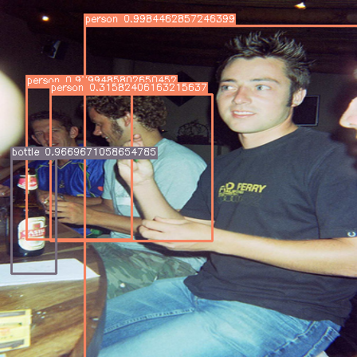
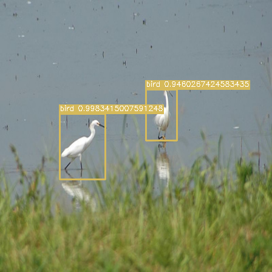

# YOLO v1 PyTorch 实现

**这个项目用于学习目的，是 YOLO v1 的 PyTorch 实现。** 原文中的网络非常难以与训练，所以我将 Backbone 替换为了预训练过的 ResNet18 和 ResNet 50。原网络已经在 `yolo.py` 中实现了，如有需要可以自行训练。原网络的与训练代码我还没写（因为我没有这个需求（雾））。

此外，根据 [YOLO v2 的 Paper](https://arxiv.org/pdf/1612.08242.pdf)，我在每一个卷积层后都添加了 BatchNorm，并去掉了 Dropout。

超参数与损失函数的实现和[原文](https://arxiv.org/pdf/1506.02640.pdf) 保持了一致。此外，网络在 VOC2007-trainval+test 和 VOC2012-train 上训练，在 VOC2012-val 上测试。我的设备为 RTX2070s。

下面是项目结构：

```
webcam.py                     # 摄像头 demo
utils
├── data.py                   # 数据
├── init.py                   # 权重初始化
├── metrics.py                # mAP 计算
├── utils.py                  # helper, e.g. Accumulator, Timer
└── visualize.py              # 可视化
yolo
├── tests.py                  # 测试样例
└── yolo.py                   # YOLO module, loss, nms
```

## 性能

|         Model          | Backbone | mAP@VOC2012-val | COCOmAP@VOC2012-val |    FPS     |
| :--------------------: | :------: | :-------------: | :-----------------: | :--------: |
| YOLOv1-ResNet18 (Ours) | ResNet18 |     44.38%      |       21.41%        | **223.61** |
| YOLOv1-ResNet50 (Ours) | ResNet50 |     45.86%      |       22.17%        |   96.16    |
|         YOLOv1         | Darknet? |    **57.9%**    |          /          |     45     |







## 数据集

在初次运行的时候（若没有数据集），需要给 `load_data_voc` 添加 `download=True` 的参数。之后可以去除，因为每次都会解压，非常耗时。

## 训练

自行训练可以使用 `resnet18-yolo-train.ipynb` 和 `resnet50-yolo-train.ipynb`。

我用的是 RTX2070s-8GB，会碰到 OOM 问题，所以我实现了梯度累计。真正的批量样本数等于 `DataLoader` 的 `batch_size` 乘上 `train` 的 `accum_batch_num`。

以 `resnet18-yolo-train.ipynb` 为例：`batch_size = 16 (dataloader/batch_size) * 4 (accum_batch_num) = 64`。此外，还还可以通过指定 `train()` 的 `num_gpu` 实现多路 GPU 并行。

下面是一些训练的 metrics:

ResNet18 (Backbone):

<div align="center">
	
</div>

ResNet50 (Backbone):

<div align="center">
	
</div>

## 测试

模型权重已经发布在 Release 里了。将其移动到 `./model/` 即可。`resnet18-yolo-test.ipynb` 和 `resnet50-yolo-test.ipynb` 为测试 `notebook`。

Update：还实现了一个实时摄像头的 demo。

## 致谢

* https://github.com/abeardear/pytorch-YOLO-v1
* https://arxiv.org/pdf/1506.02640.pdf
* https://arxiv.org/pdf/1612.08242.pdf
* 大感谢 [@dmMaze](https://github.com/dmMaze) 提供的帮助（
